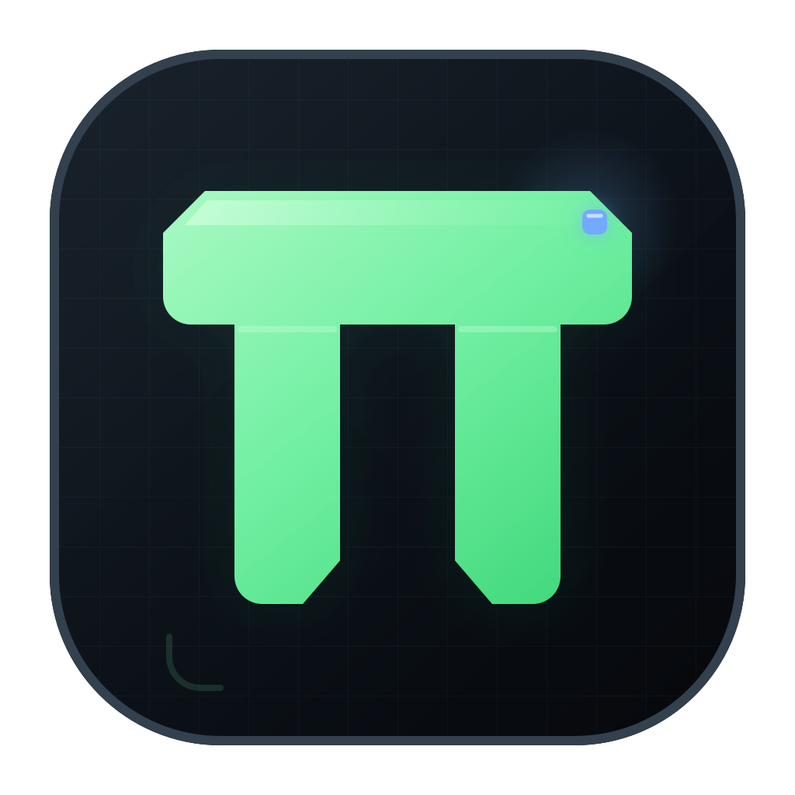

# Pi Forge

<p align="center">
  
</p>

<p align="center">
  <a href="https://github.com/fearlessfe/Pi-Forge/actions/workflows/ci.yml"></a>
  <a href="https://codecov.io/gh/fearlessfe/Pi-Forge"></a>
  <a href="https://github.com/fearlessfe/Pi-Forge/releases"></a>
</p>

[English](./README.md) | **简体中文**

> Build agents like software.

Pi Forge 是一个基于 [Pi Coding Agent](https://github.com/badlogic/pi-mono) 构建的开源 Agent 底座。它提供模型接入、Session、上下文、工具、权限、沙箱、MCP 和可观测事件等基础能力，让开发者可以像开发普通软件一样，为不同团队和业务组合、调试并交付定制 Agent。

`apps/desktop` 是 Pi Forge 的第一个参考实现：一个面向本地开发工作的 Electron 桌面端。它既是可直接使用的 Coding Agent，也是验证 Pi Forge 运行时边界和开发体验的实验场。

> 项目正在快速演进。当前版本已经完成可用的本地单 Agent 闭环；独立 Runtime、多 Agent 调度、远程执行环境和企业级控制面仍在路线图中。README 会明确区分已经实现的能力与设计方向。

## 为什么叫 Pi Forge

Forge 是锻造场，而不是一种固定形状的成品。

Pi Forge 不试图提供一个适用于所有场景的“万能 Agent”。它希望提供稳定、可组合的基础零件，让开发者根据自己的模型、数据、工具、安全策略和交付环境，锻造真正适合业务的 Agent。

## 项目理念

### 1. Agent 是软件，不是聊天窗口

一个可交付的 Agent 不只有模型和 Prompt。它还需要明确的状态、工具契约、权限边界、错误处理、可观测事件、测试和版本管理。

Pi Forge 关注完整的 Agent 生命周期，而不只是生成一次回答。

### 2. Session 不等于模型上下文

Session 是可恢复的工作记录；Context 是某一次模型调用选择看到的信息。

历史记录不应因为 compaction 或上下文裁剪而失去恢复能力。长期方向是让 Session 负责持久化事实，让 Harness 独立决定每一轮如何查询、压缩和组织 Context。

### 3. Brain 与 Hands 应当解耦

- **Brain**：模型、Harness、上下文策略和工具选择。
- **Hands**：本地沙箱、MCP Server、浏览器、远程主机或企业内部系统。

Brain 不应该依赖某一种执行环境。Hands 也不应该被永久绑定到某一个 Agent。稳定的工具和执行接口应当允许两侧独立替换与演进。

### 4. 固定接口，而不是固定 Harness

模型能力会变化，今天必要的上下文技巧和 Agent 循环可能很快过时。Pi Forge 应当对 Session、事件、工具、权限和执行环境的接口保持明确，同时允许 Harness 持续演进。

### 5. 安全来自结构，而不是提示词

Prompt 不能代替安全边界。敏感凭据、用户数据和不可信代码必须通过进程隔离、系统沙箱、最小权限、审批策略和凭据代理等机制隔离。

默认行为应当可解释、可拒绝、可撤销；危险能力必须显式获得授权。

### 6. 每一步都应当可观察、可控制

用户和开发者需要知道 Agent：

- 为什么开始或停止；
- 调用了什么工具；
- 读取或修改了什么资源；
- 消耗了多少 Token 和费用；
- 在哪里失败，以及能否恢复。

Pi Forge 将事件协议和执行轨迹视为运行时能力，而不是 UI 装饰。

### 7. 本地优先，开放扩展

项目文件、Session 和工具执行默认留在用户控制的环境中。模型、MCP、技能、扩展和未来的执行后端应通过开放接口接入，避免把开发者锁定在单一 Provider 或云服务中。

## 当前能力

| 领域 | 当前状态 |
| --- | --- |
| 模型 | 读取 Pi SDK Provider 目录，支持内置 Provider 与 OpenAI、Anthropic、Google 兼容端点 |
| 凭据 | 支持 API Key、OAuth 和 Provider 凭据链；持久化凭据通过 Electron `safeStorage` 加密 |
| Session | 本地持久化多轮会话，支持恢复、Fork、重命名、标签、归档和导出 |
| Context | 支持 Pi Session 上下文构建、compaction、上下文占用显示和模型用量记录 |
| Agent 事件 | 捕获完整的 Pi `AgentSessionEvent` 联合类型，并转换为稳定的桌面端事件 |
| 工具 | 支持读取、搜索、Shell、编辑、写入、用户询问和只读子 Agent |
| 任务控制 | 支持停止、steering、follow-up 队列和等待用户回答 |
| Runtime | Agent Harness 运行在独立子进程，支持协议化 RPC、异常自动重启和中断任务安全续跑 |
| 文件审核 | 捕获文件修改，生成 Diff，并在文件未发生二次变化时安全回退 |
| 权限 | 提供权限模式、工作区边界、敏感操作审批和项目资源信任机制 |
| 沙箱 | macOS/Linux 上通过 Anthropic Sandbox Runtime 限制命令的文件系统和网络访问 |
| MCP | 支持用户级和可信项目级的 stdio、Streamable HTTP MCP Server |
| 扩展 | 加载 Pi 扩展、技能、Prompt、主题和包，并提供能力来源与启用状态管理 |
| 桌面体验 | 提供对话、工具过程、Diff、历史会话、设置和集成终端 |

测试使用本地 OpenAI-compatible 假模型驱动真实 Pi Session，不需要真实 API Key。覆盖模型连接、流式输出、thinking、工具调用、用户询问、子 Agent、多轮上下文、停止任务、密钥隔离和事件序列。

## 当前边界

为了避免把路线图误认为现有能力，当前版本有以下明确限制：

- Agent Harness 已从 Electron 主进程拆分为独立本地 Runtime 子进程，但尚未提取成可独立部署的服务；
- 同一应用实例当前只运行一个主 Agent 任务；
- 内置子 Agent 是只读、同进程、内存 Session；
- Runtime 崩溃后会保留任务恢复记录并提供“安全继续”；为避免重复副作用，不会自动重放崩溃瞬间尚未完成的工具调用；
- 沙箱是本机命令执行边界，还没有可 Provision 的远程执行环境；
- 暂无云端同步、团队控制面、组织级策略和分布式调度；
- 当前参考实现面向桌面开发工作流，不是完整 IDE。

## 架构

当前参考实现：

```text
┌─────────────────────────────────────────────────────────┐
│ Pi Forge Desktop · React                               │
│ Conversation · Trace · Diff · Settings · Terminal      │
└──────────────────────────┬──────────────────────────────┘
                           │ Typed IPC
┌──────────────────────────▼──────────────────────────────┐
│ Electron Main                                           │
│ Window · Credentials · Browser · MCP Host               │
├─────────────────────────────────────────────────────────┤
│ Independent Agent Runtime                               │
│ Pi Session · Policy · Context · Tools · Recovery Journal │
├────────────────┬────────────────┬───────────────────────┤
│ Local Sandbox  │ MCP Servers    │ OS Keychain / PTY     │
└────────────────┴────────────────┴───────────────────────┘
```

目标边界：

```text
                       ┌──────────────────────┐
                       │  Studio / API / SDK  │
                       └──────────┬───────────┘
                                  │
┌──────────────────┐    ┌─────────▼─────────┐    ┌──────────────────┐
│ Durable Session  │◀──▶│ Agent Runtime     │───▶│ Hand Adapters    │
│ Events · Context │    │ Brain · Harness   │    │ Sandbox · MCP    │
└──────────────────┘    └─────────┬─────────┘    │ Browser · VPC    │
                                  │              └──────────────────┘
                       ┌──────────▼───────────┐
                       │ Policy · Secrets    │
                       │ Audit · Observability│
                       └──────────────────────┘
```

这个方向不要求一次性重写现有桌面应用。Pi Forge 会先从实际可用的单机闭环中提炼稳定接口，再逐步把 Runtime、Session 和 Hands 拆成可以独立部署与替换的组件。

## 快速开始

### 环境要求

- Node.js 24.10+
- pnpm 10+
- macOS 或 Linux 可获得完整的命令沙箱体验；其他平台会安全降级为执行前审批

### 启动开发环境

```bash
pnpm install
pnpm dev
```

开发命令会先编译 Electron 主进程，然后启动 Vite Renderer 和 Pi Forge Desktop。Renderer 固定监听 `http://127.0.0.1:4173`；端口被占用时会安全退出，避免 Electron 误连到其他本地服务。

### 配置模型

1. 打开左下角账户菜单，进入“设置 → 大模型”。
2. 选择 Provider 和模型，或配置兼容端点。
3. 输入 API Key，或使用对应 Provider 支持的 OAuth/系统凭据。
4. 点击“验证连接”。
5. 返回对话，通过目录菜单授权工作区后开始任务。

Renderer 只能读取凭据是否已配置以及凭据类型，不能读取 API Key、access token 或 refresh token 明文。

### 配置 Agent Trace

打开“**设置 → Trace**”即可查看并导出 Agent Trace。Pi Forge 默认以“仅元数据”模式，将 Trace 按日期写入受保护的本地 JSONL 文件。每条 Trace 会关联 Agent Run、Turn、模型 Generation、工具调用、上下文压缩、重试、Token 用量、成本、错误以及委派子 Agent 元数据。

可以添加一个或多个 OTLP HTTP Exporter，将同一批 Span 同时发送到 Langfuse、Tempo、Jaeger、Datadog 或其他兼容 OTLP 的平台。填写平台提供的 OTLP 基础 Endpoint 即可；Pi Forge 会在需要时自动补全 `/v1/traces`。可选请求头使用操作系统安全存储加密，Renderer 无法读取其明文。

内容采集支持三档：不采集内容、仅记录长度与哈希（默认）、完整记录 Prompt/输出/工具内容。所有模式都会脱敏已知凭据字段和行内 Token。任一导出平台故障只会进入独立重试队列，不会中断 Agent 执行。

## 开发与验证

```bash
pnpm lint
pnpm typecheck
pnpm test
pnpm test:coverage
pnpm build
pnpm package
```

`pnpm build` 只编译应用，`pnpm package` 会为当前操作系统生成安装包，产物位于 `apps/desktop/release`。如果只想快速检查未封装的应用目录，可以运行 `pnpm package:dir`。

### 版本发布

推送符合 SemVer 的 Tag 后，Release 工作流会先执行 lint、类型检查和单元测试，再分别使用原生 Windows、macOS 和 Linux Runner 构建应用，创建 GitHub Release 并上传安装包：

```bash
git tag v0.1.0
git push origin v0.1.0
```

工作流会生成 Windows x64 NSIS 安装程序、分别面向 Intel（x64）和 Apple Silicon（arm64）的 macOS DMG/ZIP，以及 Ubuntu x64 AppImage/Debian 安装包。上传前，每个原生 Runner 都会启动未封装的 packaged app，验证 preload、IPC、Agent Runtime handshake 和 node-pty；发布任务还会拒绝意外的自动更新 metadata、核对完整跨平台产物集合，并附带 `SHA256SUMS`。`v0.2.0-beta.1` 这类 Tag 会创建预发布版本。也可以在 **Actions → Release → Run workflow** 中为已有 Tag 手动执行发布。

默认生成的是未签名安装包。正式大范围分发前，应通过 GitHub Actions Secrets 配置各平台代码签名以及 macOS 公证凭据，否则 Windows SmartScreen 或 macOS Gatekeeper 可能向用户显示警告。

桌面应用位于 `apps/desktop`：

```text
pi-forge/
├── apps/
│   └── desktop/
│       ├── electron/       # Electron 主进程与应用服务
│       ├── src/            # React Renderer、组件与共享契约
│       └── scripts/        # 开发和运行时辅助脚本
├── docs/                   # 设计资料与验证脚本
├── package.json
└── pnpm-workspace.yaml
```

随着运行时边界稳定，计划逐步提取：

```text
packages/
├── runtime/                # Agent 生命周期与 Harness
├── session/                # 持久化事件与 Context 查询
├── hands/                  # Sandbox、MCP 和远程执行适配器
├── policy/                 # 权限、审批和组织策略
├── contracts/              # 稳定的公共协议
└── sdk/                    # 定制 Agent 开发接口
```

## 安全模型

- Electron Renderer 启用进程隔离，不直接访问 Node.js、文件系统、Shell 或凭据；
- Preload 只暴露白名单内、参数经过验证的类型化 IPC；
- API Key 和 OAuth Token 使用操作系统安全存储加密；
- 工作区外访问、危险命令、提权和破坏性 Git 操作需要显式审批；
- 平衡模式下的 Shell 在支持的平台使用 OS 级沙箱限制文件系统和网络；
- 沙箱不可用时不静默放宽权限，而是回到执行前审批；
- 项目级扩展、技能和 MCP 配置只有在项目受信任后才加载；
- 日志和 MCP 错误会对已知凭据进行脱敏；
- 文件回退会校验修改后的内容哈希，避免覆盖用户后续编辑。

长期目标是进一步将 Agent Runtime、执行环境和凭据代理分离，使不可信代码在结构上无法接触原始凭据。

## 路线图

### 阶段一：可靠的本地 Agent 闭环

- [x] 真实模型与流式 Pi Session
- [x] 本地会话持久化和历史管理
- [x] 工具过程、权限审批和任务停止
- [x] 命令沙箱、文件 Diff 与安全回退
- [x] MCP、技能、扩展和只读子 Agent
- [x] 模型用量、费用估算和上下文占用

### 阶段二：提取 Pi Forge Runtime

- [x] 从 Electron 主进程提取独立 Agent Worker
- [ ] 定义稳定的 Runtime、Session、Event 和 Hand 契约
- [ ] 将完整运行事件持久化为可查询、可重放的事件流
- [x] 支持 Runtime 崩溃检测、自动重启和中断任务安全续跑
- [ ] 支持未完成工具调用的幂等重放与完全透明恢复
- [ ] 提供用于定制 Agent 的 SDK 和示例模板

### 阶段三：多 Agent 与远程执行

- [ ] 并发任务调度和持久化子 Agent
- [ ] 可 Provision、可替换的本地与远程 Sandbox
- [ ] Agent 之间安全共享或移交 Hands
- [ ] 凭据代理、细粒度授权和完整审计链路
- [ ] Runtime 评测、追踪、成本和可靠性指标

### 阶段四：企业扩展

- [ ] 组织、项目和环境级策略
- [ ] 私有部署与企业身份集成
- [ ] 团队协作和可选的云端控制面
- [ ] Agent、工具和模板的内部目录

企业能力将建立在同一个开放 Runtime 和协议之上，不以削弱开源版本的可用性为前提。

## 参与贡献

Pi Forge 欢迎围绕以下方向的贡献：

- Agent Runtime 和 Session 架构；
- 模型 Provider 与 MCP 兼容性；
- 沙箱、安全策略和凭据隔离；
- Context Engineering、Memory 和 Compaction；
- 桌面端交互、可访问性和跨平台支持；
- 测试、文档、示例 Agent 和可复现问题。

提交改动前请至少运行：

```bash
pnpm lint
pnpm typecheck
pnpm test
```

较大的架构改动建议先通过 Issue 或设计文档明确问题、边界和兼容策略。

## 开源许可

Pi Forge 基于 [MIT License](LICENSE) 开源。

## 致谢

Pi Forge 构建于 Pi Coding Agent 及其开放生态之上，并使用 Electron、React、MCP SDK 和 Anthropic Sandbox Runtime 等开源项目。

Pi Forge 是独立社区项目；除非另有明确说明，它不代表上述项目或相关公司的官方产品。
